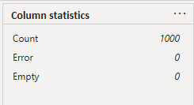
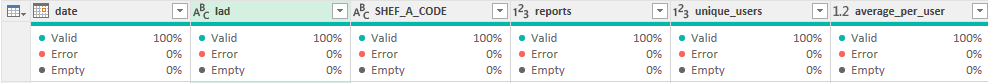
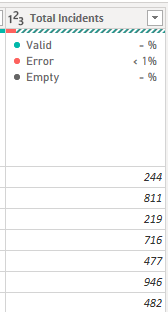

# absolutetrash

## An exploration of flytipping in Birmingham


## Data Cleaning

[Monthly data for fly-tipping incidents in Birmingham was obtained and consolidated from mysociety] (https://github.com/mysociety/fms_geographic_data/tree/master)

mysociety operates fixmystreet.com, a website where citizens can report fly-tipping incidents, amongst other local issues.

[Yearly data for fly-tippinf incidents across the UK was obtained from gov.uk] (https://www.gov.uk/government/statistics/fly-tipping-in-england).

Very little data cleansing was required as the data has been aggregated and both organisations provide background information on their methodologies which show consistency in data collection and cleansing.







## EDA

Exploratory data analysis was conducted in PowerBI

*

*
*
*

## Time Series Analysis

[Time Series in Python](https://github.com/ducksinarowdata/absolutetrash/blob/main/Flytipping_Summative.ipynb)

```
```

```
```

```
```

[Images of TS graph]

## Results


